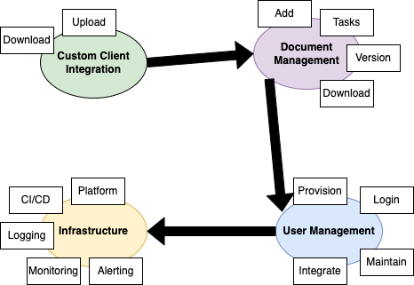

# The Example System Archtecture

Laravel, Nuxt.js, MySQL, Redis, Kubernetes, on AWS Edition

The business problem/roadmap item is the need for a document and task manager. The following is what we know so far:

- The system shall allow a user to add documents
- The system shall version documents
- The system shall allow a user to add tasks to a document
- The system shall allow a user to download a document

Considerations:

- UI currently with design
- Product started user stories but needs to ensure technical solution before continuing
- Solution needs to consider how integrations with client's document management system will be impacted/ handled.
- This roadmap item is critical to a new client launch, which is expected to be completed by October.

Existing technology/infrastructure stack/skill of developers: 

- BE API (PHP / Laravel)
- FE (Nuxt / Vue.js)
- DB (MYSQL, REDIS)
- CLOUD (AWS, Kubernetes)
- CI/CD (Github actions / ArgoCD)

Please document what questions you have, assumptions you would make when coding, technical dependencies and draft a handful of technical stories. Along with the stories, provide a magnitude of effort so we can understand what we can do as a minimum for the October release. And lastly, a diagram if applicable to assist in explaining the above.

# Proof of Concepts

Before trying to connect different tools and technologies together, it is important to understand how they both function and can integrate. It is for that reason I like to generally standup small and self-contained example repositories for getting a better understanding. In this case, the following repositories represent each individual technology consideration:

- PHP / Laravel, which includes MySQL and Redis: https://github.com/jvalentino/example-docker-laravel
- Nuxt.js: https://github.com/jvalentino/example-nuxtjs
- Kuberentes: https://github.com/jvalentino/setup-kubernetes
- ArgoCD: https://github.com/jvalentino/setup-argocd

Consider that I build such examples based on other research and supporting projects that already exist, which in this case would be:

- Docker and Docker Compose: https://github.com/jvalentino/setup-docker
- Git: https://github.com/jvalentino/setup-git

# High-Level Architecture

This additionally includes questions and assumptions and points for guiding conversations.

## (1) Highest-Level System Needs


- The only two specific asks are for Document Management and Custom Client Integration
- Implicity we know we need a means of managing users, incombination with the infrastructure for hosting any web accessible solution

## (2) "Need" Dependencies



- Implementicy everyone of the high-level needs depends on something
- We can't pull client documents into our system, with the means of being able to manage documents
- We can't manage document without underyling associated accounts with appropriate authorization
- We can't do anytyhing of this without underlying infrastructure 

## (3) User Interface Perspective


- Users generally will only understand for that which they directly interact.
- Those points of interaction are always some soft of graphical user interface
- Now is a good time to ask what our interfaces are, as that will in a major way shape the scope of what we are building
- Additionally, the number of users intended to operate will also shape the underlying architure. Dealing with more than 10k concurrent users will require some specific web-scale strategies.

## (4) MVP


- We want to build the most minimal thing possible, and get it in the hards of the user
- So far looking at the needs, it is shaping up to be these 4 domains all running on top of the infrastructure domain

## (5) Architectural Design Principales

- Domain Driven Design
- Microservices
- High Availability
- Fault Tolernt
- Defense in Depath
- Backend for Frontend
- Cloud First
- Contract Driven Design (Swagger)

## (6) Contacts and Paths of Communication


- Encryption in flight is standard
- Only the services which much talk to the public internet are expozed to it (DMZ)
- Interval services use certificate based authorization
- Domaon boundaries are quantified by Swapper API specifications for REST

## (7) Domain: Web Portal


- A distributed cache is needed to maintain BFF session tokens, so that we dont' have to use sticky sessions
- BFF pattern is used for the Web Portal's Backend
- AWS secret manager is used for secret retrieval 
- ElasticCache is used as a Redis SaaS offering
- The Web BFF communicates with the other domains via REST per the appropriate Swagger API

## (8) The important of Dev/Test is isolation


- There are two basic needs for us to be able to work independently (without other domains or services being done), and to be able to test in isolation
- Wiremock can take in swagger specs to mock behavior.

## (9) User and Document Domains


- Both of these domains are a means of separating document related logic from user related logic
- While it is possible to maintain this in a single codebase, it can end up being harder to decouple after the fact
- Also consider that will likely be other domains in the future, so it is good to start the practice and prove it out

## (10) Domain: Custom Client Integration


- There are important unanswered questions that will fundemtnally shape this archicture
- An assumption was made to use OneDrive and its REST and Webhook API to show how this could look
- There are many other potential options

## (11) Domain: Infrastructure


# Technical Examples

TBD

# References

## Distributed Caching

### Amazon ElastiCache

> Amazon ElastiCache is a fully managed in-memory data store and cache service by Amazon Web Services (AWS). The service improves the performance of web applications by retrieving information from managed in-memory caches, instead of relying entirely on slower disk-based databases. ElastiCache supports two open-source in-memory caching engines: Memcached and Redis (also called "ElastiCache for Redis").[2]

- https://en.wikipedia.org/wiki/Amazon_ElastiCache

### Amazon ElastiCache for Redis

> Welcome to the *Amazon ElastiCache for Redis User Guide*. Amazon ElastiCache is a web service that makes it easy to set up, manage, and scale a distributed in-memory data store or cache environment in the cloud. It provides a high-performance, scalable, and cost-effective caching solution. At the same time, it helps remove the complexity associated with deploying and managing a distributed cache environment.

- https://docs.aws.amazon.com/AmazonElastiCache/latest/red-ug/WhatIs.html

## Data

### RDS for MySQL

> **Amazon Relational Database Service** (or **Amazon RDS**) is a distributed [relational database](https://en.wikipedia.org/wiki/Relational_database) service by [Amazon Web Services](https://en.wikipedia.org/wiki/Amazon_Web_Services) (AWS).[[2\]](https://en.wikipedia.org/wiki/Amazon_Relational_Database_Service#cite_note-2) It is a [web service](https://en.wikipedia.org/wiki/Web_service) running ["in the cloud"](https://en.wikipedia.org/wiki/Cloud_computing) designed to simplify the setup, operation, and [scaling](https://en.wikipedia.org/wiki/Scalability) of a relational database for use in applications.[[3\]](https://en.wikipedia.org/wiki/Amazon_Relational_Database_Service#cite_note-3) Administration processes like patching the database software, backing up databases and enabling [point-in-time recovery](https://en.wikipedia.org/wiki/Point-in-time_recovery) are managed automatically.[[4\]](https://en.wikipedia.org/wiki/Amazon_Relational_Database_Service#cite_note-4) Scaling storage and compute resources can be performed by a single [API](https://en.wikipedia.org/wiki/API) call to the AWS control plane on-demand. AWS does not offer an [SSH](https://en.wikipedia.org/wiki/Secure_Shell) connection to the underlying virtual machine as part of the managed service.[[5\]](https://en.wikipedia.org/wiki/Amazon_Relational_Database_Service#cite_note-5)

- https://en.wikipedia.org/wiki/Amazon_Relational_Database_Service

> [MySQL](https://aws.amazon.com/rds/mysql/what-is-mysql/) is the world's most popular [open source](https://aws.amazon.com/products/databases/open-source-databases/) relational database and Amazon RDS makes it easer to set up, operate, and scale MySQL deployments in [the cloud](https://aws.amazon.com/what-is-cloud-computing/). With Amazon RDS, you can deploy scalable MySQL servers in minutes with cost-efficient and resizable hardware capacity.
>
> Amazon RDS for MySQL frees you up to focus on application development by managing time-consuming database administration tasks, including backups, upgrades, software patching, performance improvements, monitoring, scaling, and replication.
>
> Amazon RDS supports MySQL Community Edition versions 5.7 and 8.0 which means that the code, applications, and tools you already use today can be used with Amazon RDS.

- https://aws.amazon.com/rds/mysql/

## API

### Swagger

> Swagger was created by the team behind the original “Swagger Specification”, which has since been renamed to the OpenAPI Specification. Today, Swagger has evolved into one of the most widely used open source tool sets for developing APIs with rich support for the OpenAPI Specification, AsyncAPI specification, JSON Schema and more.

- https://swagger.io/tools/open-source/

### Wiremock

A mock API’s stubs can be exported in bulk via the admin API. This can be useful for backing up your API to source control, or cloning the contents of one API into another.

Importing

To import any of the supported formats (Swagger, OpenAPI, Postman, WireMock JSON), execute a `POST` request to the stub import URL e.g.:

```
curl -v \
  --data-binary @my-swagger-spec.yaml \
  http://localhost:8000/__admin/mocklab/imports
```

Exporting in WireMock JSON format

To export an API’s stubs, execute a `GET` request to the stub mappings admin URL e.g.:

```
curl --output my-stubs.json \
  http://localhost:8000/__admin/mappings
```

Reference: https://wiremock.org/studio/docs/import-export/api/

## Security

### TLS Mutual Auth on NGinx

Explains hwo to configure an nginx web server with the two-certificate setup.

- https://smallstep.com/hello-mtls/doc/server/nginx

### AWS Secrets Manager SDK

> The AWS SDKs consist of libraries and sample code for various programming languages and platforms, for example, Java, Python, Ruby, .NET, and others. The SDKs include tasks such as cryptographically signing requests, managing errors, and retrying requests automatically. For more information, see AWS SDKs.
>
> To download and install any of the SDKs, see [Tools for Amazon Web Services](https://aws.amazon.com/tools/#sdk).
>
> For SDK documentation, see:
>
> - [C++](http://sdk.amazonaws.com/cpp/api/LATEST/namespace_aws_1_1_secrets_manager.html)
> - [Java](https://docs.aws.amazon.com/AWSJavaSDK/latest/javadoc/com/amazonaws/services/secretsmanager/package-summary.html)
> - [PHP](https://docs.aws.amazon.com//aws-sdk-php/v3/api/namespace-Aws.SecretsManager.html)
> - [Python](https://boto3.amazonaws.com/v1/documentation/api/latest/reference/services/secretsmanager.html)
> - [Ruby](https://docs.aws.amazon.com/sdk-for-ruby/v3/api/Aws/SecretsManager.html)
> - [.NET](https://docs.aws.amazon.com/sdkfornet/v3/apidocs/items/SecretsManager/NSecretsManagerModel.html)
> - [Node.js](https://docs.aws.amazon.com/AWSJavaScriptSDK/latest/AWS/SecretsManager.html)
> - [Go](https://docs.aws.amazon.com/sdk-for-go/api/service/secretsmanager/)

- https://docs.aws.amazon.com/secretsmanager/latest/userguide/asm_access.html

## Platform

### EKS CloudFormation

> Creates an Amazon EKS control plane.
>
> The Amazon EKS control plane consists of control plane instances that run the Kubernetes software, such as `etcd` and the API server. The control plane runs in an account managed by AWS, and the Kubernetes API is exposed by the Amazon EKS API server endpoint. Each Amazon EKS cluster control plane is single tenant and unique. It runs on its own set of Amazon EC2 instances.
>
> The cluster control plane is provisioned across multiple Availability Zones and fronted by an Elastic Load Balancing Network Load Balancer. Amazon EKS also provisions elastic network interfaces in your VPC subnets to provide connectivity from the control plane instances to the nodes (for example, to support `kubectl exec`, `logs`, and `proxy` data flows).
>
> Amazon EKS nodes run in your AWS account and connect to your cluster's control plane over the Kubernetes API server endpoint and a certificate file that is created for your cluster.

- https://docs.aws.amazon.com/AWSCloudFormation/latest/UserGuide/aws-resource-eks-cluster.html